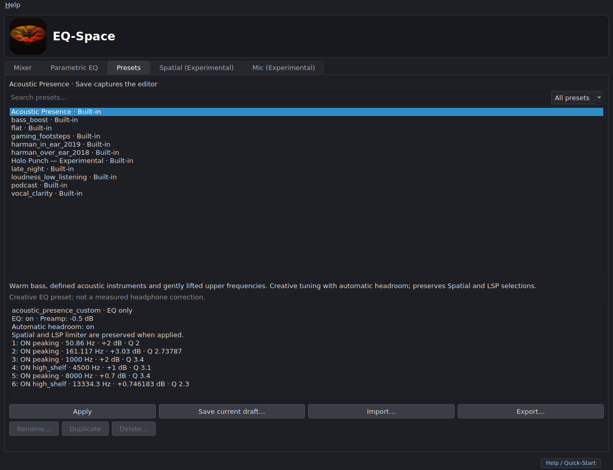
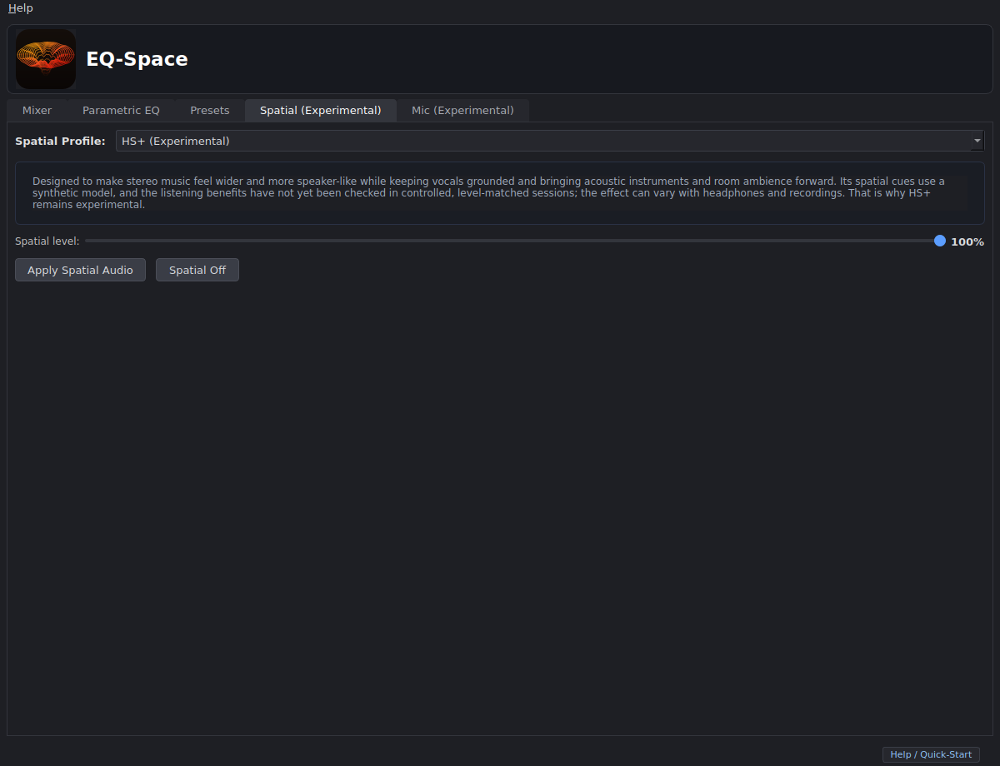

<p align="center">
  
</p>

# EQ-Space for Linux

**Shape your sound. Give stereo more space.**

EQ-Space is a desktop parametric equalizer and experimental spatial audio app for Linux. Choose your headphones or speakers, apply a preset, and tune your sound while music plays. PipeWire handles the audio processing; the app manages the filters and playback route.

**Status:** early-access source build. Ubuntu 24.04 LTS is the development baseline. EQ-Space is not currently published in Ubuntu App Center or the Snap Store. See [installation and distribution](docs/distribution.md) for the available build formats.


*Screenshots show the current application with neutral demonstration data. The response graph is a calculated EQ preview, not a live spectrum or headphone measurement.*

## Features

- **Parametric EQ:** edit frequency, gain, Q and filter type from the graph or table. Manual preamp and automatic headroom are separate controls.
- **Preset library:** browse built-in presets, search your saved presets, preview changes, and import or export EQ-Space JSON and supported APO/AutoEQ parametric text.
- **Independent processing:** enable EQ, Spatial and the optional LSP limiter in any order. Turning one stage off preserves the others.
- **Live adjustment:** active EQ edits and applied Spatial output-level changes update in the background, with the latest edit retained while an update is in progress.
- **Experimental Spatial:** explore HoloSpace 3D, Cinema, Studio Monitor, natural crossfeed and **HS+ (Experimental)**. HS+ aims for a wider, more speaker-like presentation with grounded vocals and more forward acoustic instruments. Its synthetic model and listening results are not validated across headphones and recordings.
- **Mixer:** choose a physical output and adjust individual applications' volume or mute.
- **Optional LSP limiter:** an independent downstream stage when a compatible LSP Limiter Stereo plugin and PipeWire LV2 host are installed.
- **Local profiles and diagnostics:** save your own EQ or full playback setup, inspect errors, and export a diagnostic report when needed.

Spatial uses synthetic headphone models by default. It does not decode Dolby Atmos, and no Dolby certification is claimed. The Mic tab is experimental and requires a separate DeepFilterNet plugin and capture-routing setup.

## Install from source

Use Ubuntu 24.04 with a working PipeWire/WirePlumber user session and Python 3.12 or newer. The commands `pw-cli`, `pw-dump`, `pw-link`, `pw-metadata` and `wpctl` must be available.

```bash
sudo apt install python3-venv pipewire-bin wireplumber libegl1 libopengl0
git clone https://github.com/AlejandroZmtZ/EQ-Space-for-Linux.git
cd EQ-Space-for-Linux
python3 -m venv .venv
.venv/bin/pip install .
.venv/bin/python tools/install-desktop-entry.py
```

Open **EQ-Space** from your application menu, or run:

```bash
.venv/bin/eqspace
```

The launcher installer adds the desktop entry and logo to your user account. Run it again after moving the installation directory. Start the app after installing the launcher so the desktop can associate its dock icon correctly.

## Start listening

1. Start playback in a music player or browser.
2. Choose your headphones or speakers in **Mixer**.
3. Open **Presets**, select a preset, and click **Apply**.
4. Adjust the active EQ in **Parametric EQ**. Choose a Spatial profile and click **Apply Spatial Audio** to enable it.

**Spatial Off** preserves EQ and LSP. **Turn off EQ** preserves Spatial and LSP. Quit through the app to restore direct playback before its filter modules are unloaded. Loading a saved profile at startup restores the editor; it does not automatically apply audio processing.


## Make it yours

Save the current editor with **Save current draft…**. Choose **EQ only** to keep the current Spatial and limiter selections when applying it, or **Full playback** to restore all three stages. Built-in EQ presets preserve Spatial and LSP. Your saved presets support rename, duplicate, delete and export.



Start with **Flat**, **Vocal Clarity**, **Holo Punch — Experimental**, or **Acoustic Presence**, then adjust to taste. Creative presets are listening choices, not measured corrections for your headphones. Compare settings at similar, comfortable listening levels. The [listening playlist](https://music.youtube.com/playlist?list=PLUUAIRc-NmAs) provides a selection of music for trying the controls.



## Help and troubleshooting

- **PipeWire unavailable:** check `pw-cli info 0` and `wpctl status`. EQ-Space needs the current user's working PipeWire session.
- **No sound or unexpected routing:** inspect the Mixer status and listening device. Disable the processing stages or quit normally to restore direct playback. `pw-link -l` shows actual links.
- **Cannot save a preset:** the user configuration directory must be writable. Run from a normal user installation; a read-only launch environment cannot save profiles.
- **LSP unavailable:** install a compatible plugin and matching PipeWire LV2 host. See [limiter setup](docs/lv2-host.md).
- **No tray icon:** tray support depends on the desktop. Use the main window to quit.

Launch with `eqspace --debug` for detailed logs. **Help → Open logs** opens local diagnostics; **Help → Copy diagnostic report** copies a report for you to review before sharing. Reports may contain device names and local paths. See [privacy and local data](docs/privacy.md).

[Report a bug](https://github.com/AlejandroZmtZ/EQ-Space-for-Linux/issues) with your distribution, PipeWire version, steps to reproduce and a redacted error report. Profiles can also be listed without applying audio:

```bash
eqspace --list-profiles
```

## Documentation and development

- [User guide](docs/user-guide.md)
- [Architecture and playback transactions](docs/architecture.md)
- [Current HS+ implementation](docs/spatial-hybrid.md)
- [Installation, packaging and Ubuntu store compatibility](docs/distribution.md)
- [Testing and support limits](docs/testing.md)
- [Contributing](CONTRIBUTING.md)

## License

GPL-3.0-or-later. See [LICENSE](LICENSE).
