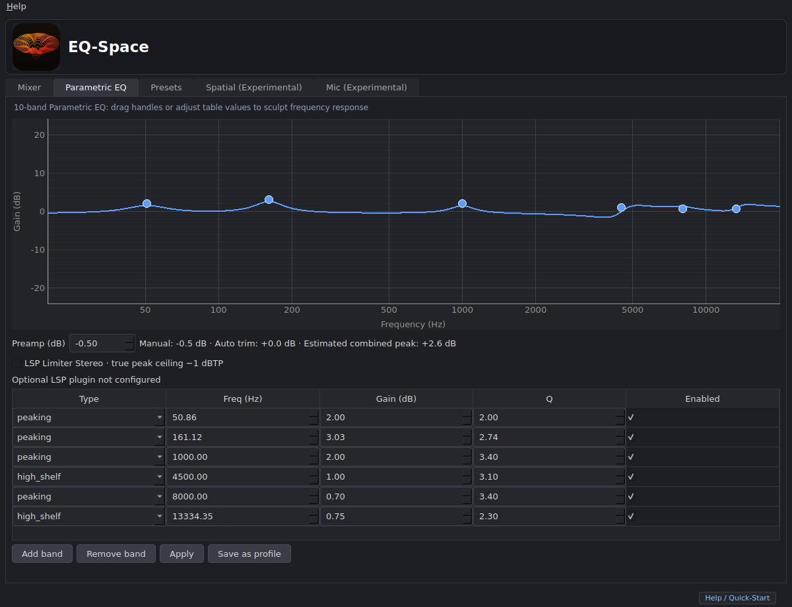
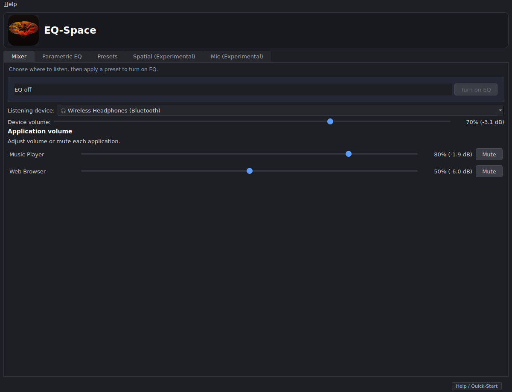

# EQ-Space for Linux

EQ-Space is a **GUI-first prototype** for a PipeWire system-wide parametric equalizer. Python builds filter-chain configurations and controls PipeWire; PipeWire performs the audio processing. The main flow is selecting a built-in EQ preset and applying it from the Presets tab, with optional Spatial processing before EQ.

The goal is a user-friendly, straightforward app for people who know how they like their audio to sound and want the freedom to shape it. EQ-Space also lets Ubuntu and Linux users explore an immersive, Dolby Atmos-like listening experience through experimental 3D spatial audio. This is virtual spatial processing rather than Dolby Atmos decoding or certification. The spatial features are an ongoing experiment, with the aim of improving their quality and usability over time.



## What works

- Parametric EQ with editable bands, a frequency-response graph, and a PipeWire filter chain.
- Nine built-in EQ presets, including **Flat** (no EQ bands, 0 dB manual preamp). Select one to see its description, then click **Apply**. Compatible filter layouts update controls in place; changed layouts stage a new sink and verify the route before retiring the old one.
- Spatial can feed EQ, and **Spatial Off** preserves the active EQ bands and preamp. The Spatial level control changes effect gain; it does not mix in a dry signal. Mic remains an independent experimental path.
- A separate automatic trim estimates headroom for new profiles and built-in presets. The displayed combined peak is calculated from the EQ response and offline Spatial references, not measured loudness or guaranteed clipping protection.
- Per-app volume and mute controls, an EQ toggle, and a physical listening-device selector. An optional LSP Limiter Stereo LV2 stage appears only when the installed plugin exposes the required true-peak mode and ports; it is off by default.
- Local JSON profiles with atomic writes. The GUI loads the last saved profile into the editor at startup; click Apply to activate it. While EQ is active, graph, band and preamp edits update sound automatically after a 180 ms pause, using verified Apply and headroom. Edits while EQ is bypassed remain in the editor until Apply.
- Spatial offers crossfeed and a **synthetic KEMAR-style model**; it is not a measured KEMAR SOFA recording. External SOFA files need optional `pysofa`. Mic noise reduction needs the DeepFilterNet LADSPA plugin and capture routing setup.

## Try it with music

Use this [YouTube Music listening playlist](https://music.youtube.com/playlist?list=PLUUAIRc-NmAs&si=qkxFFdodNwziEA33) to explore EQ presets, customize the sound and experiment with 3D spatial profiles. Compare settings with familiar tracks at a comfortable listening volume. The playlist is a listening aid, not a technical audio test or an Atmos source requirement.

## Requirements

- Linux with PipeWire and WirePlumber (`pw-cli`, `pw-dump`, `pw-link`, `wpctl`, and `pw-metadata` available).
- Python 3.12 and Qt desktop support. Ubuntu 22.04/24.04 are the intended targets.
- A working audio output. The filter chain exists only while EQ-Space is running.

## Install and run

```bash
git clone https://github.com/AlejandroZmtZ/EQ-Space-for-Linux.git
cd EQ-Space-for-Linux
python3.12 -m venv .venv
.venv/bin/pip install -e .
.venv/bin/eqspace
```

Use the Mixer tab to choose a physical listening device. Start audio playback, open **Presets**, select an EQ preset, and click **Apply**. Mixer then shows whether EQ is on. Open Spatial and click **Apply Spatial Audio** to place it before EQ; **Spatial Off** returns to EQ alone. **Turn off EQ** keeps Spatial active if it is on. If the status says an app is on another device or not using EQ, that app's current audio link did not follow the chosen route. Application rows control volume and mute. Quit from the window or tray to restore direct output. The desktop launcher source is in `data/desktop/eqspace.desktop`; install that and the icon separately if you want an application-menu entry. The wheel includes the icon used by the tray.



The only command-line operation is read-only:

```bash
.venv/bin/eqspace --list-profiles
```

## Troubleshooting

- **Apply failed / PipeWire unavailable:** run `pw-cli info 0` and `wpctl status` in a terminal. Start or repair your user PipeWire and WirePlumber services before retrying. EQ-Space reports the failure in the Presets tab and keeps the window open.
- **No sound after applying:** check the Mixer status and selected listening device. Turn off Spatial and EQ to restore direct output, then retry. `wpctl status` shows the current default sink, and `pw-link -l` shows the actual app and filter links. Quit EQ-Space to restore direct routing before retrying.
- **No tray icon:** tray support depends on your desktop. Keep the main window open and quit it normally.
- **Spatial, limiter, or Mic unavailable:** External SOFA extraction requires `pysofa`; the optional limiter requires LSP Limiter Stereo LV2 1.2.24 or newer with true-peak support and a matching PipeWire LV2 host ([Ubuntu setup](docs/lv2-host.md)); microphone processing requires a separately installed DeepFilterNet LADSPA plugin. The mic level meter is hidden until real capture activity metering is available.

## Development

```bash
.venv/bin/pip install -e '.[dev]'
QT_QPA_PLATFORM=offscreen .venv/bin/pytest tests/ -q
.venv/bin/pip wheel . --no-deps --wheel-dir dist
```

Tests use fake PipeWire backends where possible. Headless CI checks do not certify live audio routing; verify the GUI and restore path on a PipeWire desktop before distribution.

- [Architecture and runtime design](docs/architecture.md)
- [Engineering lessons and agent guidance](docs/agent-lessons.md)
- [Verification record and known limitations](docs/verification.md)
- [Report a bug](https://github.com/AlejandroZmtZ/EQ-Space-for-Linux/issues)

## License

GPL-3.0-or-later. See [LICENSE](LICENSE).
