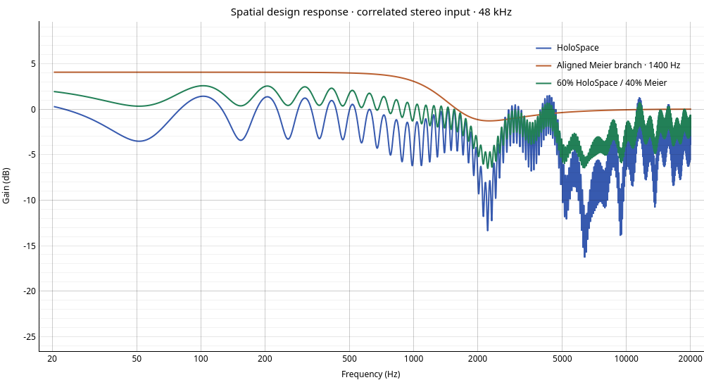
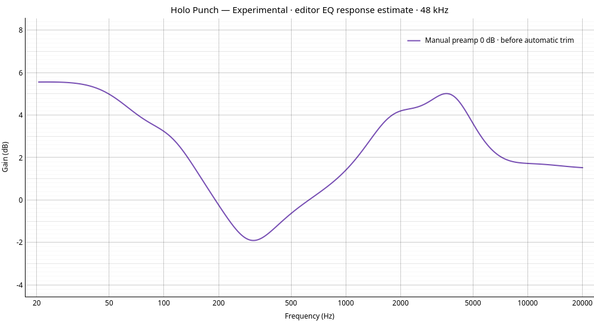

# HS+ (Experimental): current processing design

The additional **HS+ (Experimental)** (HoloSpace + Meier) profile runs HoloSpace and a Meier branch in parallel inside one native PipeWire filter chain. Its tuning is fixed at HoloSpace 60%, Meier 40%, with the hybrid crossfeed cutoff at 1400 Hz and output level initially 100%. Selecting a profile prepares editor state; **Apply Spatial Audio** changes the selected graph. On an applied profile, output level uses a verified mixer-control transaction. Balance and crossover tuning controls are absent. Output level scales the complete mix; it is not a dry/wet blend. At zero, both hybrid branches are muted. Standalone HoloSpace, Cinema, Studio Monitor and crossfeed graph choices remain available.

```text
             ┌─ HoloSpace stereo expansion → 10 ear convolvers → H_L/H_R ─┐
stereo input ┤                                                           ├─ weighted stereo mixers → identical stereo EQ → optional LSP → output
             └─ direct + opposite-channel lowpass → common delay → M_L/M_R┘
```

Python only prepares coefficients, IR files, static estimates and controls. PipeWire performs audio processing. Playback autoconnection is disabled: the controller stages a unique module and explicitly links and verifies its downstream path before publishing it.

## Transfer and latency

For input column vector `x=[L,R]`, output is `y=l[0.6H+0.4M]x`, where `l` is output level. Complementary **linear** weights sum to one before output level; there is no equal-power boost. The output mixers expose `hybrid_l:Gain 1/2` and `hybrid_r:Gain 1/2`. An output-level change sends all four coefficients in one batch while retaining the fixed 60/40 ratio. Installed PipeWire 1.0.5 provides the required copy, convolver, biquad, delay and mixer nodes; no ramp builtin is assumed. Throttling reduces command traffic, but it does not establish sample-by-sample interpolation or click-free automation. [PipeWire builtin source](https://raw.githubusercontent.com/PipeWire/pipewire/1.0.5/src/modules/module-filter-chain/builtin_plugin.c).

`H` uses the existing five speakers FL −30°, FR +30°, FC 0°, SL −100°, SR +100°. FL/SL receive L; FR/SR receive R; FC receives `(L+R)/2`. Each ear sums its speaker convolutions with gain 1/5. The synthetic 512-sample model retains its ten-sample common predelay, position-dependent interaural differences, and 7100 Hz, −8 dB, Q=3 pinna filter. The requested reflection offset is 12 ms, but the existing 512-sample model clamps this offset to 464 samples when it exceeds the IR length: 10.52 ms at 44.1 kHz, 9.67 ms at 48 kHz, 4.83 ms at 96 kHz. The reflection is relative to the already delayed response, and its late tail is truncated by the IR length. No synthetic geometry, normalization, delay or reflection was retuned for the hybrid.

`M=z^-10 [[1,gP],[gP,1]]`, with `g=10^(-4.5/20)`. `P` matches the **actual rendered** hybrid Meier path: `bq_lowpass`, Freq=1400, Q=0.5. Standalone Meier retains its 650 Hz cutoff. The existing crossfeed configuration also records 300 μs and a coefficient helper offers direct-path compensation; neither is used by the existing renderer, so neither is added here. [Meier's original circuit article](https://headwizememorial.wordpress.com/2018/03/09/an-enhanced-bass-natural-crossfeed-filter/) gives historical context, not a claim that this simplified native graph reproduces that circuit.

A native-source test exposed a significant estimation detail: PipeWire 1.0.5's lowpass interprets its Q port as **resonance in dB**, using its Chromium-derived formula, rather than RBJ quality factor. The hybrid estimator uses that native formula, with float32 coefficient rounding. Reusing the existing RBJ helper would predict a different opposite-channel response. See [PipeWire biquad implementation](https://raw.githubusercontent.com/PipeWire/pipewire/1.0.5/src/modules/module-filter-chain/biquad.c).

The entire Meier branch, including direct and crossfeed, receives ten samples of common delay. HoloSpace IRs are untouched, preserving interaural timing and reflection differences. Native delay converts float seconds to an integer sample offset by truncation. Its control uses `10.25/fs` seconds, an interior value which truncates reliably to ten across the tested rates. The quarter-sample offset is not a fractional audio delay. Offline native tests verify HoloSpace convolution introduces no additional block offset for chunks 32, 64, 127 and 256 with the renderer’s native defaults (512-sample IR: blocksize 256/tailsize 4096). This establishes the configured kernels' impulse alignment; desktop total latency and scheduling remain unmeasured.

## Design response figures



The figure compares correlated left/right input at 48 kHz, with output level 100%, before automatic trim. It is a design prediction, not a headphone measurement or a level-matched listening comparison. The Meier curve includes the hybrid's common ten-sample alignment; this delay does not change its magnitude response.



The punch preset's editor EQ estimate shows its low-frequency lift, low-mid cut, and vocal/snare presence boosts before automatic trim. Actual loudness depends on the selected Spatial profile and limiter. Recreate both figures with `.venv/bin/python tools/plot-spatial-hybrid.py`; no sound device is accessed.

## Combined reserve and control transaction

The estimator forms the actual 2×2 impulse matrix `T=l[0.6H+0.4M]`, then transforms each entry before calculating the worst output-row sum `max_f max_ear (|T_ear,L(f)|+|T_ear,R(f)|)`. This retains the phase and cancellations within every combined matrix entry and bounds independently phased stereo sinusoidal inputs. It includes DC and Nyquist, channel-isolated and correlated responses, opposed stereo, impulses and logarithmic sweeps. An additional impulse L1 row bound reserves bounded sample sequences conservatively. Reserve is calculated from the combined matrix, not from a sum of standalone dB values. The API reports `estimated_peak_gain_db` to the graph controller. A static reserve is not a measured true-peak level, loudness normalization, or proof of clipping protection for every playback condition.

The controller must reserve the maximum of the previous and requested positive estimate **before** publishing controls or a new graph. It verifies all requested Spatial controls and the complete route, then releases surplus reserve. A failed update keeps or restores conservative gain and verifies previous controls. Graph changes use the applied profile snapshot; pending profile selections or EQ edits cannot become live through a level callback. A graph-rate change requires preparing against the actual rate again. Saved state records the profile identity and output-level `wet` key. Legacy balance and crossover values are ignored; loading and saving through the editor removes these obsolete tuning keys.

The order stays Spatial → identical stereo EQ → optional LSP. Scalar identical linear time-invariant EQ `E(f)I` commutes with the Spatial matrix: `(E I)T=T(E I)`. This follows the series property of linear time-invariant filters; it does not apply to different left/right EQ, time-varying edits, or nonlinear limiting. LSP remains downstream, after the complete summed signal. [Series combination of LTI filters](https://www.dsprelated.com/freebooks/filters/Series_Combination_Commutative.html).

## Evidence and listening boundary

Deterministic tests cover the fixed 60/40 combination and its separate branch references at 44.1/48/96 kHz, exact zero output, profile state and explicit Apply, complex row bounds, reference signals and control batching. The optional native test compiles the original PipeWire 1.0.5 convolver, FFT, mixer and biquad implementations and the original delay-run function. It compares individual kernels and the full two-input/two-output hybrid impulse matrix against the offline estimate. Upstream convolution discards partition tails below 1e-6; comparison tolerances account for this and float32 arithmetic.

Reproduce the native check with a pristine extracted PipeWire 1.0.5 source tree:

```bash
EQSPACE_PIPEWIRE_SOURCE=/path/to/pipewire-1.0.5 QT_QPA_PLATFORM=offscreen .venv/bin/pytest tests/test_spatial_native.py -q
QT_QPA_PLATFORM=offscreen .venv/bin/pytest tests/test_spatial_hybrid.py tests/test_ui_spatial.py tests/test_spatial.py -q
```

The native harness requires a C compiler; it contacts no daemon or sound device. It establishes kernel response, not successful module loading, desktop route behavior, audible quality, gaplessness, true peak or release readiness. Perceived improvement is not established by these checks. Controlled level-matched listening and target-package route validation are required for claims about fidelity, presence or audible switching quality. See [testing and support limits](testing.md).
